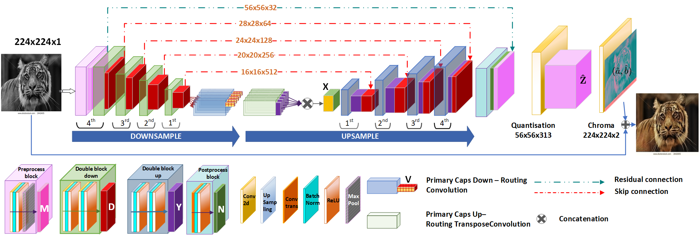

# Image_Colourisation_WiCV_2021
Collaborative Image and Object Level Features for Image Colourisation

Image colourisation is an ill-posed problem, with multiple correct solutions which depend on the context and object instances present in the input datum. Previous approaches attacked the problem either by requiring intense user-interactions or by exploiting the ability of convolutional neural networks (CNNs) in learning image-level (context) features. However, obtaining human hints is not always feasible and CNNs alone are not able to learn entitylevel semantics, unless multiple models pre-trained with supervision are considered. In this work, we propose a single network, named UCapsNet, that takes into consideration the image-level features obtained through convolutions and entity-level features captured by means of capsules. Then, by skip connections over different layers, we enforce collaboration between such the convolutional and entity factors to produce a high-quality and plausible image colourisation.

We pose the problem as a classification task that can be addressed by a fully unsupervised approach, thus requires no human effort. Experimental results on three benchmark datasets show that our approach outperforms existing methods on standard quality metrics and achieves state-of-theart performances on image colourisation. A large scale user study shows that our method is preferred over existing solutions.

##Architecture

 
